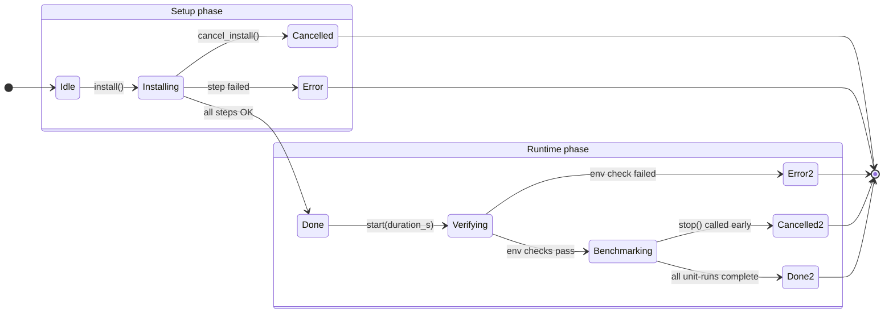
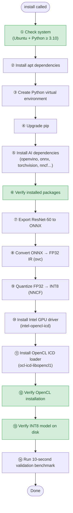
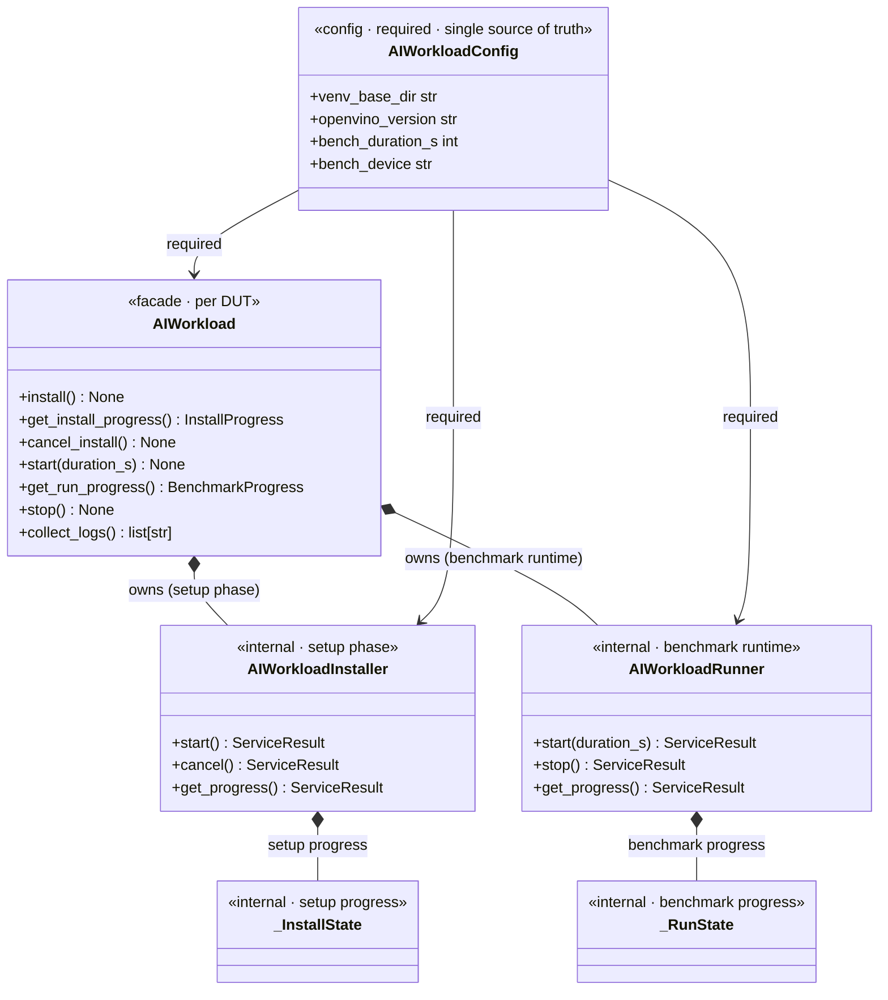

# `ai_workload` — AI Workload Service

Manages AI workload **setup** and **benchmark runtime** on a single DUT target.
One `AIWorkload` instance is created per DUT by the orchestrator.

---

## Package layout

```
ai_workload/
├── __init__.py      Public API surface
├── service.py       AIWorkload — main entry point (setup + runtime)
├── installer.py     AIWorkloadInstaller — threaded setup worker
├── runner.py        AIWorkloadRunner — threaded benchmark loop
├── setup.py         build_setup_steps / build_verify_steps / SETUP_TASK_NAMES
├── config.py        AIWorkloadConfig — all tunable parameters with defaults
├── state.py         Shared types: ServiceResult, StepStatus, WorkloadState,
│                    InstallProgress, BenchmarkProgress, _InstallState, _RunState
├── helper.py        _run_cmds — executes command dicts via ExecutionTransport
└── run.py           Low-level benchmark primitives (_start_benchmark, _stop_benchmark)
```

---

## Two-phase lifecycle



---

## Setup phase — step sequence

`install()` spawns a daemon thread that runs these steps in order.
Steps tagged **verify** are also reused by `start()` before the benchmark.



> **Green** steps are verification-only steps reused by `start()` via `build_verify_steps()`.

---

## Class relationships

`AIWorkload` is the per-DUT **facade**. It owns one `AIWorkloadInstaller` and
one `AIWorkloadRunner` — both created at construction time and bound to the
same `AIWorkloadConfig` instance. Both are **internal collaborators** (not for
direct use); `AIWorkload` delegates the full setup phase to `AIWorkloadInstaller`
and the benchmark runtime to `AIWorkloadRunner`.



---

## Usage pattern

```python
from time_config_hub.services.ai_workload import AIWorkload
from time_config_hub.infra.execution_transport import ExecutionTransport

transport = ExecutionTransport(...)          # one per DUT
workload  = AIWorkload(transport)

# ── Setup phase ──────────────────────────────────────────────
workload.install()                          # non-blocking; spawns thread

while True:
    progress = workload.get_install_progress()
    print(progress.overall_percent, progress.state)
    if progress.state in ("done", "error", "cancelled"):
        break
    time.sleep(2)

# ── Runtime phase ────────────────────────────────────────────
workload.start(duration_s=30)              # verify env, then run benchmark

metrics = workload.get_run_progress()      # BenchmarkProgress
print(metrics.latency_avg_us, metrics.throughput_fps)

workload.stop()
logs = workload.collect_logs()             # retrieves report JSON from DUT
```

---

## State and progress types

| Type | Returned by | Purpose |
|---|---|---|
| `ServiceResult` | `installer.*`, `runner.*` | Wrapper: `status_code`, `output`, `error`, `data` |
| `InstallProgress` | `get_install_progress()` | Install snapshot: `state`, `overall_percent`, `steps[]` |
| `BenchmarkProgress` | `get_run_progress()` | Metrics snapshot: `run_index`, `total_runs`, `percent_complete`, latency, throughput |
| `StepStatus` | `StepDict.status` | `PENDING → RUNNING → DONE / FAILED / CANCELLED` |
| `WorkloadState` | `_InstallState.state`, `_RunState.state` | `NOT_STARTED → RUNNING → DONE / ERROR / CANCELLED` |

---

## Configuration

All parameters have sensible defaults — `AIWorkloadConfig()` is fully
default-constructible.  Override only what you need:

```python
from time_config_hub.services.ai_workload import AIWorkload
from time_config_hub.services.ai_workload.config import AIWorkloadConfig

config = AIWorkloadConfig(
    venv_base_dir="/opt/custom",
    bench_duration_s=60,
    bench_device="GPU",
)
workload = AIWorkload(transport, config=config)
```

Key defaults:

| Parameter | Default | Description |
|---|---|---|
| `venv_base_dir` | `/opt/tch` | Root install directory on target |
| `openvino_version` | `2026.1.0` | OpenVINO pip version |
| `bench_duration_s` | `5` | Per-run benchmark duration (seconds) |
| `bench_device` | `CPU` | OpenVINO inference device |
| `bench_cpu_cores` | `"4,5"` | CPU core affinity for `taskset` |
